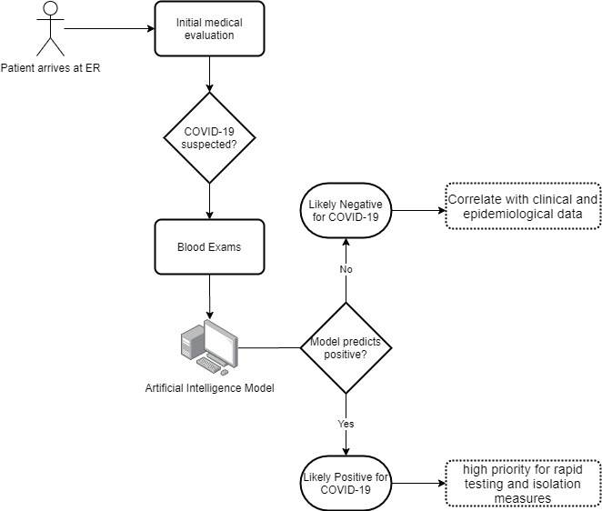

# ER-CoV

ER-CoV is a framework backed by Artificial Intelligence (AI) that uses simple blood exams to help to perform COVID-19 screening in Emergency Rooms (ER). The focus or ER-CoV is to determine which patients are likely to be negative for the coronavirus, such that more specific exams can be prioritized for those deemed as likely positive.

This repository contains the code used for the article "A novel specific artificial intelligence-based method to identify COVID-19 cases using simple blood exams".

To the best of our knowledge, this is the first solution of its kind. We developed a machine learning classifier that takes widely available simple blood exams as input and classifies samples as likely to be positive (having SARS-CoV-2) or negative (not having SARS-CoV-2). Our work has already been submitted to the Journal of the American Medical Informatics Association (JAMIA) and has been receiving media attention (https://bit.ly/2xNTes8). Our article preprint is already available online: https://www.medrxiv.org/content/10.1101/2020.04.10.20061036v2.

 

## Performance

  - Specificity: 85.98% [95%CI 84.34 - 86.84]
  - Sensitivity: 70.25% [95%CI 66.57 - 73.12]
  - Negative Predictive Value (NPV): 94.92% [95%CI 94.37 - 95.37]
  - Positive Predictive Value (PPV): 44.96% [95%CI 43.15 - 46.87]
  - Area Under the ROC Curve (AUC): 86.78% [95%CI 85.65 - 87.90]

## Plots

License
----

GNU GPL

